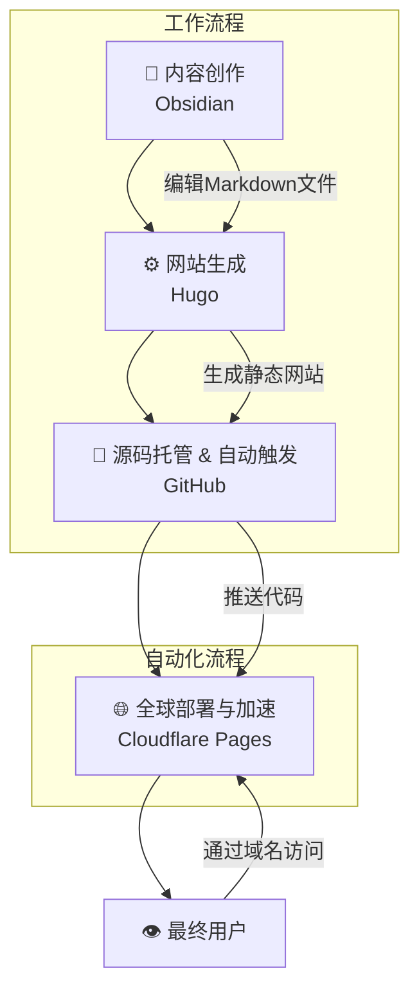

# 想法

本来是在学习的时候刷博客看到别人认真经营的博客网站，记录着自己的学习历程分享知识。想起来自己也曾经偶尔在CSDN上公众号上写写东西，其实每次自己也就是从小白的视角记录分享我的经验和理解，算不上什么有技术含量的东西，但是还是偶尔有帖子得到一些收藏点赞，甚至私信询问。所以也算得上帮助了一些人，还是有用的。加上自己本身有记笔记的习惯，所以总想着有一个自己的正式的ID，正儿八经去分享也能够在写博客的时候理清思绪和逻辑，能够让知识更加清晰顺便拯救一下自己的文字表达能力。奈何自己总是一时兴起三分钟热度，公众号太久没更都封了，文章没写几篇就停了。行动力是有的，这不三下五除二又给自己搞了个网站。至于这次能够坚持多久就不知道了。而且最近愈加感觉自己的心性慢不下来了，做什么都很急躁，没有耐心，研一买了三本书，至今还没读完，甚至写日记都开始变得敷衍了事。总觉得有更重要更要紧的事情要做。可好像那些所谓的更要紧的事情也没有做的很好。我太急了，应该放慢一点脚步👣。

上面就是一些胡言乱语的小想法，言归正传。借着自己喜欢记录的性子开通这个博客，主要分享一些学习的知识教程之类的，也会偶尔分享自己乱七八糟天马行空的想法和有意思的生活点滴。期待我的观众。

# 创建博客教程

写这个教程一方面是为了有需要的人一个指引也是给自己留个备份(万一哪天忘了呢哈哈哈)
主要的用了 hugo+ github+cloudflare+ obsidian


## 注册域名（非必要）

[(99+ 封私信 / 58 条消息) 零基础如何搭建一个属于自己的网站（超详细记录） - 知乎](https://zhuanlan.zhihu.com/p/1926206677583139289)

注册域名是非必要的，因为本身你在后面用cloudflare部署的时候会自动分一个免费的域名。但是都建站了注册一个玩一玩也是可以的，我是在腾讯云买的新用户有优惠，本身这个域名也不贵，价格可以接受。

购买网站：
[域名专场特惠](https://cloud.tencent.com/act/pro/domain?page=domain-sales&s_source=https%3A%2F%2Fcloud.tencent.com%2Fact%2Fpro%2Fdomain-sales&fromSource=gwzcw.1293314.1293314.1293314&cps_key=806a34e58199d2e0ccdf9a10ef0ba6ac&s_refer=https%3A%2F%2Flink.zhihu.com%2F%3Ftarget%3Dhttps%253A%2F%2Fcloud.tencent.com%2Fact%2Fcps%2Fredirect%253Fredirect%253D37491%2526cps_key%253D806a34e58199d2e0ccdf9a10ef0ba6ac)
至于选哪个域名，作为个人博客来说其实用不上com cn 后期续费还贵，.top .site .me这些应该够用。

#### 登录域名控制台创建域名信息模板

1、打开[域名控制台](https://link.zhihu.com/?target=https%3A//console.cloud.tencent.com/domain/template)信息模板页面

2、点击新建模板并填写相应信息
注意：提交后无需等待审核成功即可注册域名。
#### 注册喜欢的域名

详细的步骤我就不赘述了，我是按照这个教程注册的：[(99+ 封私信 / 64 条消息) 零基础如何搭建一个属于自己的网站（超详细记录） - 知乎](https://zhuanlan.zhihu.com/p/1926206677583139289)

但是注意只需要参考到注册域名部分就可以，后面的需要购买服务器（本教程不需要，而是通过下面的国外的cloudflare进行托管——主要是免费）

## Hugo安装及生成网站
[Hugo 安装保姆级教程](https://blog.yimengtut.online/p/hugo-%E5%AE%89%E8%A3%85%E4%BF%9D%E5%A7%86%E7%BA%A7%E6%95%99%E7%A8%8B/)

按照上面教程链接一步步操作即可。需要补充的是，当你设置主题的时候，先打开exampleSite文件夹看一看有没有hugo.yaml或者hugo.toml  它类似于网站的配置文件 之
![[Pasted image 20251031183424.png]]
后打开对照theme这一行的名字，保证主题文件夹的名字与这个一致。
![[Pasted image 20251031183609.png]]

之后直接将hugo.yaml和content文件夹复制到网站的文件夹下，替换掉原有的，这是本身没有之前文章的情况，如果有记得拷贝到content。而且一定注意此时目录下只有hugo.yaml或者hugo.toml，因为默认Hugo 会按以下顺序查找配置文件：

- `hugo.toml`
    
- `hugo.yaml`
    
- `hugo.json`
在项目中只能选择其中一个，不能同时存在。

![[Pasted image 20251031184255.png]]
### 部署到 Github  

1、创建一个**与你用户名相同的仓库**，比如
```git
<Github用户名>.github.io
```

比如我注册的名字是 nono741852.所以这里我创建的仓库的名字必须是 ： nono741852.github.io
![[Pasted image 20251031185717.png]]
之后就可以将本地的网站文件push到这个仓库了

2、将网站资源上传部署到github

在你刚刚放置网站的文件夹下
## cloudflare服务器托管
[免费的个人网站托管-Cloudflare - ！win ！ - 博客园](https://www.cnblogs.com/xwwin/p/19019164)

Cloudflare 是一家全球知名的网络安全与性能优化公司，主要为网站、应用等提供服务。它通过遍布全球的边缘网络，帮助用户抵御网络攻击（如 DDoS 攻击），同时加速内容加载速度，还能管理域名解析等，让网络服务更安全、稳定、高效


## Cloudflare Pages 自动构建和部署
https://cursorhub.org/tutorials/fullstack-guide/server-deployment/cloudflare-deployment

[Compute (Workers) | Workers & Pages | 1557024601@qq.com's Account | Cloudflare](https://dash.cloudflare.com/c1a5e4879189a0cf41972b25b27e9344/pages/view/nono741852-github-io/fbca79a1-e5cb-418a-85d9-335432b916ca)


**DNS 查询网站**
[DNS Checker - DNS Check Propagation Tool](https://dnschecker.org/#A/rynnono.top)
![[Pasted image 20251031161328.png]]

1. **如果 dnschecker 显示正确**，那说明问题只是时间差，Cloudflare 的状态更新有延迟，请耐心等待最多1-2小时。
    
2. **如果 dnschecker 显示错误或为空**，说明你的 DNS 记录修改没有成功保存或生效，需要回到 Cloudflare DNS 设置页面重新检查。
	我当时出现的就是第二种情况，所以可以排查还是DSN设置的有问题。
## obisidian 创建内容


## 段落和文本格式

这是一个普通段落。它可以包含**粗体文本**、*斜体文本*、***粗斜体文本***、~~删除线~~、`行内代码`和[链接文本](https://example.com)。

这是另一个段落，用于测试段落之间的间距。

## 引用块

> 这是一个简单的引用块。
> 
> 引用块可以包含多个段落。

> 这是一个嵌套引用的例子：
> 
> > 这是嵌套引用的内容。
> > 
> > 可以有多层嵌套。

## 列表

### 无序列表

- 第一项
- 第二项
  - 嵌套项 1
  - 嵌套项 2
    - 更深层的嵌套项
- 第三项

### 有序列表

1. 第一项
2. 第二项
   1. 嵌套有序项 1
   2. 嵌套有序项 2
      1. 更深层的嵌套项
3. 第三项

### 任务列表（复选框）

- [x] 已完成的任务
- [ ] 未完成的任务
- [x] 另一个已完成的任务
- [ ] 嵌套任务列表
  - [x] 子任务 1（已完成）
  - [ ] 子任务 2（未完成）
  - [x] 子任务 3（已完成）

### 定义列表

术语 1
: 这是术语 1 的定义。

术语 2
: 这是术语 2 的定义。
: 术语可以有多个定义。

## 代码

### 行内代码

这是一个包含 `console.log('Hello World')` 的段落。

### 代码块

```javascript
function greet(name) {
  console.log(`你好，${name}！`);
}

greet('世界');
```

```python
def fibonacci(n):
    if n <= 1:
        return n
    return fibonacci(n-1) + fibonacci(n-2)

print(fibonacci(10))
```

```css
.prose {
  max-width: none;
  color: var(--tw-prose-body);
}

.prose h1 {
  font-size: 2.25rem;
  font-weight: 700;
}
```

## 表格

| 左对齐 | 居中对齐 | 右对齐 |
|:-------|:--------:|-------:|
| 内容 1 | 内容 2   | 内容 3 |
| 较长的内容 | 中等     | 短     |
| 数据 A | 数据 B   | 数据 C |

## 水平分割线

---

## 图片


## 链接

这是一个[普通链接](https://example.com)。

这是一个[带标题的链接](https://example.com "链接标题")。

这是一个引用式链接：[引用链接][1]

[1]: https://example.com "引用链接标题"

## 脚注

这是一个包含脚注的段落[^1]。

这里是另一个脚注[^note]。

[^1]: 这是第一个脚注的内容。

[^note]: 这是命名脚注的内容。

## 高亮文本

这是一个包含==高亮文本==的段落。

## 上标和下标

H~2~O 是水的化学分子式。

E = mc^2^ 是爱因斯坦的质能方程。

## 键盘按键

按 <kbd>Ctrl</kbd> + <kbd>C</kbd> 复制文本。

## 缩写

HTML 是*超文本标记语言*的缩写。

*[HTML]: 超文本标记语言

## 数学公式（如果支持 KaTeX）

行内公式：$E = mc^2$

块级公式：

$$
\int_{-\infty}^{\infty} e^{-x^2} dx = \sqrt{\pi}
$$

## 提示框（如果支持）

> [!NOTE]
> 这是一个注意事项。

> [!TIP]
> 这是一个提示。

> [!IMPORTANT]
> 这是重要信息。

> [!WARNING]
> 这是一个警告。

> [!CAUTION]
> 这是一个注意事项。

## 详情（如果支持）

<details>
<summary>点击展开详情</summary>

这是折叠的详细内容。

你可以在这里包含任何 Markdown 语法：

- 列表项
- **粗体文本**
- `代码`

</details>

## 混合内容测试

这个段落包含多种格式：**粗体**、*斜体*、`代码`、[链接](https://example.com)、~~删除线~~、==高亮==。

### 复杂列表

1. 包含**粗体**文本的第一项
   - 包含`代码`的嵌套项
   - 包含[链接](https://example.com)的另一个嵌套项
2. 包含*斜体*文本的第二项
   1. 有序嵌套项
   2. 另一个有序嵌套项
3. 包含~~删除线~~文本的第三项

### 复杂表格

| 功能                        | 状态  | 描述     |
| ------------------------- | :-: | ------ |
| **粗体**                    |  ✅  | 支持粗体文本 |
| *斜体*                      |  ✅  | 支持斜体   |
| `代码`                      |  ✅  | 支持行内代码 |
| [链接](https://example.com) |  ✅  | 支持链接   |
| ~~删除线~~                   |  ❌  | 需要测试   |

这个测试文档涵盖了大多数常见的 Markdown 语法，可以用来验证文档样式的完整性和美观性。
